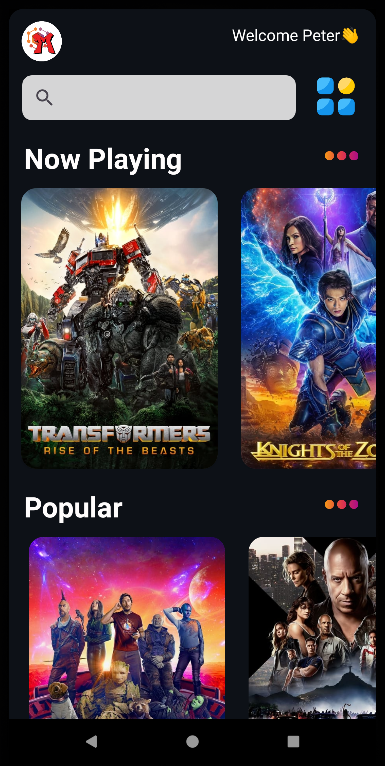
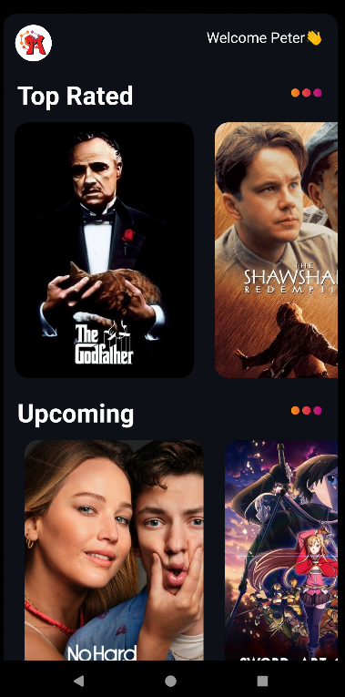
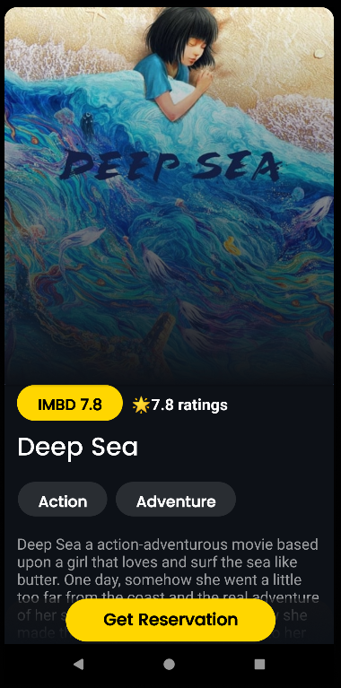

# MoviZephyr

`Note: Under Development. Have Patience :):`

<p align="center">
	
</p>

```

MoviZephyr, a simple movie app ...

```

## Screenshots 

* Landing Screen

* Home Screen

* Movie Info Screen

<br>

<p align="center">
Landing Screen
</p>

<p align="center">
	
</p>

<p align="center">
Home Screen
</p>

<p align="center">
	
</p>

<p align="center">
	
</p>

<p align="center">
Movie Info Screen
</p>

<p align="center">
	
</p>