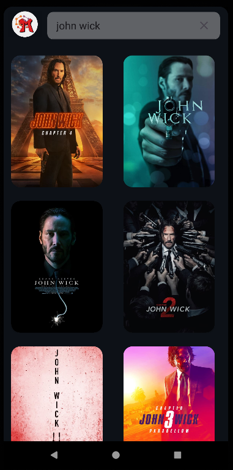
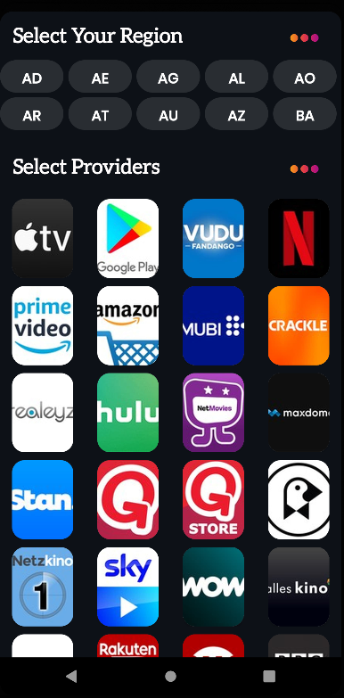

# MoviZephyr

	

Introducing our movie reservation mobile app! 🎉 **MoviZypher** 🎬 Seamlessly browse movie listings, thier detail and select watch provider effortlessly. 💺💫 Enjoy hassle-free payments and instant ticket confirmations, enhancing convenience and accessibility.Elevate your movie-going journey 🚀 with our user-friendly app, designed to optimize your entertainment encounters. Discover a new standard of cinematic convenience today. 🍿

## Screenshots 

* Landing Screen

* Home Screen

* Movie Info Screen

* Movie Search

 

<table>

<tr>
<td>

	

</td>

<td>

	

</td>

<td>

	

</td>

<td>

	

</td>

<td>

	

</td>

</tr>
</table>
